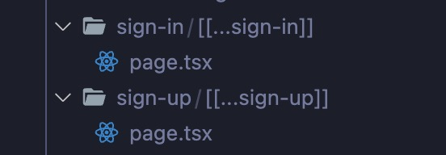

# Next.js全栈应用开发

> 技术栈：Next.js 13 + Tailwind CSS + MongoDB + Clerk

要说最近比较火的APP 应该就是 Threads 了。这是APP界的新星，用户数量玩命似的往上窜——Meta旗下新应用程序Threads上线的仅5天，登记用户人数已经超过1亿（Threads于美国时间7月5日晚间上市）。

这个速度已经打破了ChatGPT的纪录（两个月超1亿用户），目前Threads成为史上用户数增长速度最快的消费者App。对此，我也是颇感兴趣，也去看了下热闹。u1s1，这UI是真好看！所以，心痒难耐之下就想借鉴它来开发一个自己的社区Web应用 [Woiq-threads](https://threads.woiq.xyz/)


优势
--------
Next.js 13 有一个大升级就是，打包工具使用了 [Turbopack](https://turbo.build/pack), Turbopack 是针对 JavaScript 和 TypeScript 优化的增量打包工具，由 Webpack 的创建者 Tobias Koppers 和 Next.js 团队使用 Rust 编写。在大型应用上，它的更新速度比 Vite 快 10 倍，比Webpack 快 700 倍。在更大的应用上，通常会比 Vite 快 20 倍（和 vite 对比的这数值不太可信，我觉得应该有点为了齐整而夸大了，但还是比vite更快没毛病！）。

Next.js 13 有一些新的用法：

1. 之前版本都是使用 Page router（页面路由） , Next.js 13版本建议使用 App Router（应用路由），这个模式写起来也挺舒服，其实就是目录结构变化。
2. Server Component（服务器端组件） 和 Client Component（客户端组件）是 Next.js 13的一个特色，服务器组件的实时重新加载功能用起来很爽。
3. 流式处理（也叫流式编译）。页面在整个包被解析之前就开始渲染。这会缩短交互时间 (TTI)，特别是对于大型应用程序。
4. 国际化路由。Next.js 13 支持自动语言检测和国际化路由的 URL 前缀。这使得构建多语言网站变得更加容易。
5. 环境变量支持。Next.js 13 支持将环境变量在浏览器中使用，只要给需要的环境变量加上 `NEXT_PUBLIC_` 前缀
6. Next.js 13 内置了对 CSS 和 Sass 的支持。这意味着您可以直接在 JavaScript 文件中导入 CSS 文件。它还支持 CSS 模块，自动将 CSS 范围限定到各个组件。
7. Next.js 13 支持静态站点生成 (SSG)，这意味着您可以在构建时预渲染页面。这对于内容较多的网站特别有用，因为它可以提高性能和搜索引擎优化。
8. Next.js 13 允许您将 API 直接构建到 Next.js 应用程序中。您可以在该目录下创建Serverless函数，相当于独立的微服务`/pages/api`（这是重点！全栈就靠这个）。


Clerk
--------
我这里使用的 [Clerk](https://clerk.com/) 需要注意一下，它是一个托管安全登录鉴权工具，也负责用户管理，内含了用户管理组件，登录、注册组件。UI都很漂亮。接入了 clerk 之后，登录鉴权这块就变得极其容易了，免费版对于轻应用的个人开发者来说就很适合，功能都足够了。


开发过程
--------
在开发的过程中，其实倒是没有太大的阻碍，主要是部署问题（等下再说 :sweat_smile:）

这是我用到的依赖包：

``` json
"dependencies": {
    "@clerk/nextjs": "^4.23.2",     //身份验证和用户管理的一个工具
    "@clerk/themes": "^1.7.5",      // Clerk 自定义主题
    "@hookform/resolvers": "^3.2.0",
    "@radix-ui/react-label": "^2.0.2",
    "@radix-ui/react-slot": "^1.0.2",
    "@radix-ui/react-tabs": "^1.0.4",
    "@types/node": "20.4.9",
    "@types/react": "18.2.20",
    "@types/react-dom": "18.2.7",
    "@uploadthing/react": "^5.2.1",
    "autoprefixer": "10.4.14",
    "class-variance-authority": "^0.7.0",       // CSS in-TS 库, shadcn 处理UI样式的相关依赖
    "clsx": "^2.0.0",       // 用于有条件地构造字符串, shadcn 处理UI样式的相关依赖
    "cross-env": "^7.0.3",
    "eslint": "8.46.0",
    "eslint-config-next": "13.4.13",
    "lucide-react": "^0.265.0",     // 用于 react 应用程序的 lucide 图标库的实现
    "mongoose": "^7.4.3",       // 一个 Node 平台的 MongoDB JS库, 轻便简洁，数据库操作API齐全
    "next": "13.4.13",
    "postcss": "8.4.27",
    "react": "18.2.0",
    "react-dom": "18.2.0",
    "react-dropzone": "^14.2.3",
    "react-hook-form": "^7.45.4",       // react的一个轻量级表单验证库
    "svix": "^1.8.1",       // 处理 Webhook 的一个工具
    "tailwind-merge": "^1.14.0",    // shadcn 处理UI样式的相关依赖
    "tailwindcss": "3.3.3",
    "tailwindcss-animate": "^1.0.6",
    "typescript": "5.1.6",
    "uploadthing": "^5.3.2",        // 文件存储服务
    "zod": "^3.21.4"        // 以 TypeScript 为首的模式声明和验证库, 弥补了 TypeScript 无法在运行时进行校验的问题, Zod 既可以用在服务端也可以运行在客户端
  }
```

1. 首先配置好 Tailwind的自定义主题，然后在 `.env.local` 文件中配置 Clerk 秘钥、[Uploadthing](https://uploadthing.com/) 文件上传秘钥、MongoDB 连接信息（使用 [Mongoose](https://mongoosejs.com/docs/index.html) ）等等。(具体配置参考官方文档就可以)

2. 接下来在中间件中配置 Clerk 和 路由拦截配置：

``` ts
import { authMiddleware } from "@clerk/nextjs";

/** 
 * 权限验证中间件
 */
// This example protects all routes including api/trpc routes
// Please edit this to allow other routes to be public as needed.
// See https://clerk.com/docs/nextjs/middleware for more information about configuring your middleware
export default authMiddleware({
    publicRoutes: ['/api/webhook/clerk'],
    ignoredRoutes: ['/api/webhook/clerk']
});

export const config = {
  matcher: ["/((?!.*\\..*|_next).*)", "/", "/(api|trpc)(.*)"],
};
```


如果需要支持国际化（next内置[国际化](https://next-intl-docs.vercel.app/docs/next-13)），则是这样：
``` ts {2,7-10,19}
import { authMiddleware } from "@clerk/nextjs";
import createMiddleware from 'next-intl/middleware';

/** 
 * 根据用户区域进行国际化处理 将路由转向到对应[lang]的路由  例如：app/[lang]/layout.js
 */
const intlMiddleware = createMiddleware({
  locales: ["en", "zh", "ja"],
  defaultLocale: "en",
});

/** 
 * 权限验证中间件
 */
// This example protects all routes including api/trpc routes
// Please edit this to allow other routes to be public as needed.
// See https://clerk.com/docs/nextjs/middleware for more information about configuring your middleware
export default authMiddleware({
  beforeAuth: (req) => { return intlMiddleware(req) },
  publicRoutes: ["/:lang/sign-in", '/api/webhook/clerk'],
  ignoredRoutes: ['/api/webhook/clerk']
});

export const config = {
  matcher: ["/((?!.*\\..*|_next).*)", "/", "/(api|trpc)(.*)"],
};
```


3.  `next.config.js` 配置（主要是有图片上传，需要用到外部图片，具体参考 [remotepatterns](https://nextjs.org/docs/app/api-reference/components/image#remotepatterns)）：

``` js
const nextConfig = {
  // 从服务器组件捆绑中选择退出特定依赖项并使用本机 Node.js
  experimental: {
    serverActions: true,
    serverComponentsExternalPackages: ["mongoose"],
  },
  eslint: {
    // Warning: This allows production builds to successfully complete even if your project has ESLint errors.
    ignoreDuringBuilds: true,
  },
  // 为获取外部图片做配置
  images: {
    remotePatterns: [
      {
        protocol: "https",
        hostname: "img.clerk.com",
      },
      {
        protocol: "https",
        hostname: "images.clerk.dev",
      },
      {
        protocol: "https",
        hostname: "uploadthing.com",
      },
      {
        protocol: "https",
        hostname: "placehold.co",
      },
    ],
  },
};

module.exports = nextConfig
```


4. Clerk 拦截路由后会重定向到它指定的路由，所以还需要做以下操作：

* 在 `.env.local` 中配置：
``` .env.local
# Clerk 默认公共路由， 如需国际化 则需要加上 /[lang]
NEXT_PUBLIC_CLERK_SIGN_IN_URL=/sign-in
NEXT_PUBLIC_CLERK_SIGN_UP_URL=/sign-up
NEXT_PUBLIC_CLERK_AFTER_SIGN_IN_URL=/onboarding
NEXT_PUBLIC_CLERK_AFTER_SIGN_UP_URL=/
```    
* 文件目录结构：



::: tip OK
emm... 其实这些配置在官方文档中都是有的，就不一一介绍了，只需要记住按照官方文档的配置就没问题。:stuck_out_tongue_closed_eyes:
:::


部署
--------
:weary: 害，到了部署这就头疼。简单说下，因为我使用的是 Jenkins容器，所以Jenkins执行构建脚本时会有一个用户问题——默认是Jenkins用户而不是宿主机用户，随之就产生了文件操作权限问题、脚本执行的子线程在执行完毕后Jenkins会自动 kill 子线程，进而导致服务起不来，部署就不生效。

所以，在这上面我就好好被折腾了一番功夫。:triumph:


问题总结
--------
记录一下遇到的问题：
1. 因为要请求数据库服务，受限于云服务器性能，首页渲染的时间也会受影响（本地开发的话是很快的）

2. 由于本项目中有 Clerk 等托管服务，Nginx 反向代理那里需要配置一些header配置，不然会引发一系列401和404问题。

3. Clerk 捕获到未授权请求后会进行跳转，跳转请求的URL中协议是`http` ，若网站是`https`协议则会导致请求失败（需要通过 Nginx 配置80转443）

4. Next.js 默认先加载 `.env.local` 文件，然后加载其它 `.env.*` 文件的顺序是根据`package.json`中 `'script'` 命令中来的，`'dev'` 命令的话加载 `.env.development`，`'start'` 命令加载 `.env.production`，最后加载 `.env` 文件。

5. Jenkins 运行项目能力不足可能直接就挂了（可能是Jenkins节点需要增加亦或者是云主机性能不足）

6. Jenkins（尤其是 docker 中的 Jenkins）执行完脚本后会 kill 掉子进程，所以在其中所起的服务需要为执行对应任务的Jenkins节点配置环境变量或是在脚本中设置环境变量（BUILD_ID）用于替换进程ID, 从而使Jenkins 不能kill 服务进程。

7. pm2 在宿主机环境直接管理 Node 应用服务，需要先 `stop` 再 `restart` , 或者 `delete` 后再启动也可以 （如果是 Jenkins 容器环境则不需要，Jenkins每次重启也就会清空子线程任务）

8. 服务端组件需要注意性能（要注意 MongoDB 的 `populate` 操作对性能的影响）


---
最后，如果要部署到生产模式的话， Clerk 上也可以切到生产模式，秘钥要记得根据环境替换一下。需要注意的就是，几个域名要注册好，不然出现转发问题。

